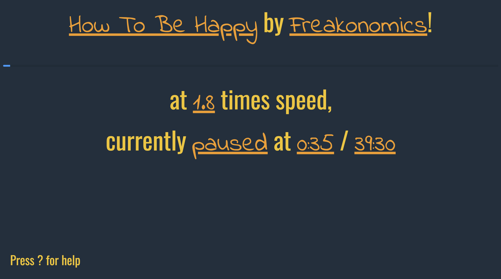

# SpeedCast

Online podcast player with finely adjustable speed controls. Everything is controlled via vim-style keyboard shortcuts:
* `j`/`k` Speed up/down by 0.1
* `h`/`l` Seek forwards/backwards by 5 seconds
* `H`/`L` Change podcast
* `space` Toggle play/pause



## Getting Started

Follow these instructions to get a copy of the object up and running on your local machine.

### Prerequisites

```
mongodb
```

### Installation

```
npm install
npm start

```

The app will be running on `localhost:3000`

## Development
`npm run react-dev` to build with webpack

`npm run react-dev` to start nodemon server

### Built with
* React
* Webpack
* Mongoose
